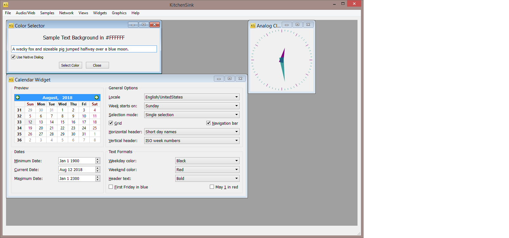

## CopperSpice on Visual Studio 2017 Community Edition 15.7.6

Continuous integration status from appveyor (VS2017)

[](https://ci.appveyor.com/project/janwilmans/copperspice)

Here is kitchensink compiled with Visual Studio 2017 Community Edition 15.7.6, in x86 release configuration.

[](https://github.com/copperspice/copperspice)

## Bleeding edge problems

I still have problems building in certain configurations

- x86-Release: OK (Visual Studio 2017 Community Edition 15.7.6)
- x64-Debug: linker error (below)

inconsistent behaviour for 
- Visual Studio 2017 Community Edition 15.8 **Preview 5**
- Visual Studio 2017 Community Edition 15.7.6

Specifically for Visual Studio 2017 Community Edition 15.8 **Preview 5** x64-Debug configuration I get:

```
Error    LNK2019    unresolved external symbol _HBeginPaint referenced in function "private: static struct HDC__ * __cdecl WebCore::PluginView::hookedBeginPaint(struct HWND__ *,struct tagPAINTSTRUCT *)" 

Error    LNK2019    unresolved external symbol _HEndPaint referenced in function "private: static int __cdecl WebCore::PluginView::hookedEndPaint(struct HWND__ *,struct tagPAINTSTRUCT const* )"
```

also for Visual Studio 2017 Community Edition 15.8 **Preview 5** x86-Release configuration I get:

```
C:\Program Files (x86)\Microsoft Visual Studio\Preview\Community\Common7\IDE\MASM : warning A4018: invalid command-line option : -UHAVE_CONFIG_H
   Assembling: ..\..\..\src\3rdparty\webkit\Source\WebCore\plugins\win\PaintHooks.asm
C:\Program Files (x86)\Microsoft Visual Studio\Preview\src\3rdparty\webkit\Source\WebCore\plugins\win\PaintHooks.asm(27): error A2006: undefined symbol : r10
C:\Program Files (x86)\Microsoft Visual Studio\Preview\src\3rdparty\webkit\Source\WebCore\plugins\win\PaintHooks.asm(42): error A2006: undefined symbol : r10
  Microsoft (R) Macro Assembler Version 14.15.26720.0
  Copyright (C) Microsoft Corporation.  All rights reserved.
```  
  

### Introduction
CopperSpice is of a set of C++ libraries used to develop cross-platform software applications. This is an open source project
released under the LGPL V2.1 license. CopperSpice was derived from the Qt framework. Our motivation for developing CopperSpice was to
change the core design and leverage modern C++ functionality.

The libraies provided in CopperSpice include:

 * CsCore
 * CsGui
 * CsMultimedia
 * CsNetwork
 * CsOpenGL
 * CsPhonon
 * CsScript
 * CsSql
 * CsSvg
 * CsWebKit
 * CsXml
 * CsXmlPatterns

There are also three open source BSD licensed libraries which are used by CopperSpice and available as stand alone libraries
for anyone developing a C++ application.

 * CsSignal
 * CsString
 * libGuarded


###### Major enhancements

Reflection
 * No Meta-Object Compiler is required for generating meta data, all references were removed
 * The functionality provided by moc was replaced with compile time templates
 * CopperSpice automatically generates meta data for processing Signals/ Slots and Introspection
 * A template class can now inherit from QObject with no restrictions on types
 * Complex data types such as **QMap&lt;QString, int&gt;** can be used without restriction

Enhanced Functionality
 * CopperSpice makes extensive use of modern C++ features like variadic templates, constexpr, SFINAE, lambdas, atomics,
   tuple, etc
 * Reimplemented container classes in CsCore using the C++ standard library containers, iterators, and algorithms
 * CopperSpice includes several of the Qt 5 classes
 * Integration of CsSignal
   * Improved thread aware Signal/Slot delivery
   * Increased efficiency while maintaining the full Signal/Slot API
 * Integration of CsString
   * Improved storage of Unicode strings
   * QString8 (UTF-8) and QString16 (UTF-16)

Using the Libraries
 * Any application using CopperSpice can be built with CMake, GNU Autotools, or any other build system
 * CopperSpice can be linked directly into any standard C++ application


### System Requirements

To use the CopperSpice libraries you will need a C++14 compiler and a C++14 standard library.

Uses CMake or Autotools for building binary files. Your project can be built with either CMake
or Autotools. Refer to our CopperSpice Overview documentation, DoxyPress application, or our
KitchenSink demo for sample build files.


### Building

The CopperSpice libraries can be built using CMake or GNU Autotools.


### Documentation

###### API

Full class documentation for CopperSpice is available on the CopperSpice website or downloaded from our forum.

www.copperspice.com/docs/cs_api/index.html


###### Overview and Building

The CopperSpice Overview documentation includes information on how to build the CopperSpice libraries, setting up a
project which uses CopperSpice, how to migrate from Qt to CopperSpice, and other general information.

www.copperspice.com/docs/cs_overview/index.html


### Presentations

Our YouTube channel videos are about modern C++, build systems, CopperSpice, DoxyPress, and other topics related to our
open source work.

https://www.youtube.com/copperspice


Links to technical presentations recorded at CppNow and CppCon:

www.copperspice.com/presentations.html


### Authors / Contributors

* **Ansel Sermersheim**
* **Barbara Geller**
* **Robin Mills**
* **Ivailo Monev**
* **Adam Mensel**
* **Daniel Pfeifer**
* **Zbigniew Skowron**
* **Matan Nassaw**
* **Mortaro Marcello**


### License

This library is released under the LGPL V2.1 license. For more information refer to the LICENSE files provided with
this project.


### References

* Website: www.copperspice.com
* Email:   info@copperspice.com
